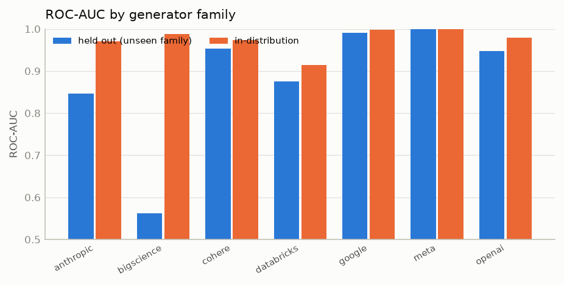
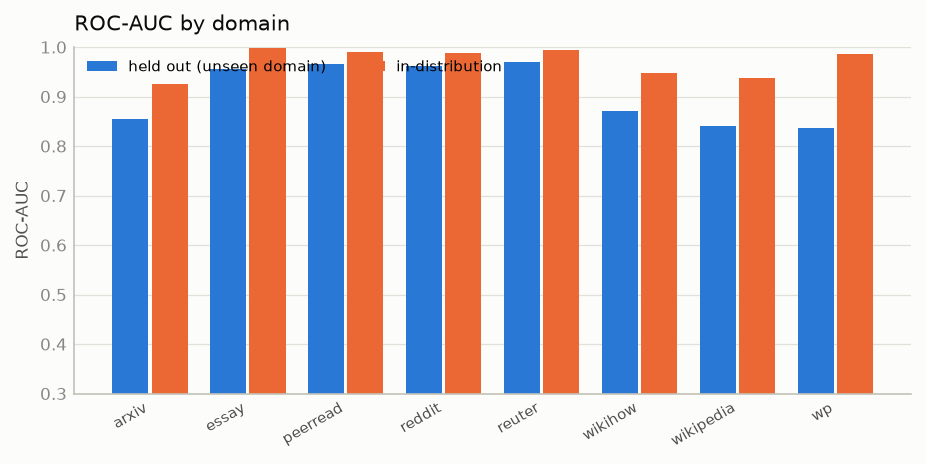
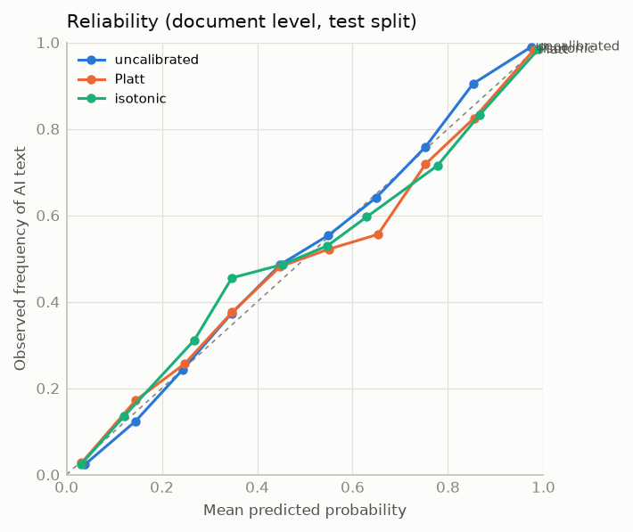
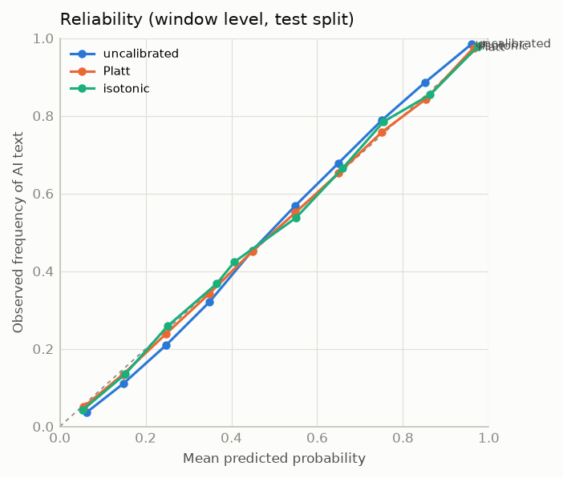
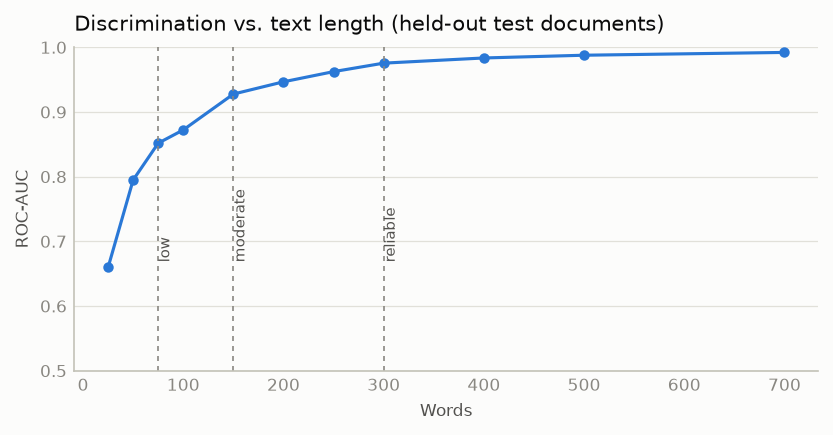
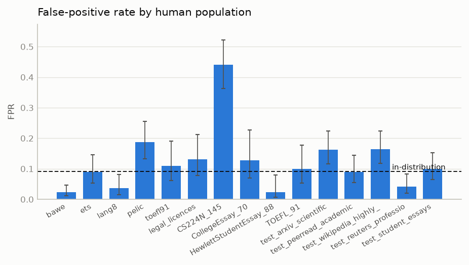

# Evaluation report (en)

Model `en-20261002-783106e4aa39-nonnative` · evaluated 2026-10-02 23:06:09 · dataset version `783106e4aa39` · seed 13. All numbers below are produced by `evaluate.py` and read from `evaluation_results.json`; nothing is hand-edited.

> **Scope.** These results describe *this* model on *these* datasets. All AI text in training and test comes from 2023-era generators (GPT-3.5, text-davinci-003, Cohere, Dolly-v2, BLOOMZ, Flan-T5, LLaMA, Claude 2023). Performance on newer models, other domains, other languages and real classroom populations is not established by this report. Probabilities are calibrated for a 50 % prior.

## 1. Held-out test set (document level)

Test documents: 3526 (1418 human, 2108 AI), grouped so that no prompt or source text appears in both training and test. 95 % CIs from a group-level bootstrap.

| Metric | Value | 95 % CI |
|---|---|---|
| Accuracy | 0.907 |  [0.898–0.916] |
| Precision | 0.936 |  [0.927–0.945] |
| Recall (TPR) | 0.906 |  [0.893–0.918] |
| F1 | 0.921 |  [0.913–0.929] |
| ROC-AUC | 0.972 |  [0.968–0.976] |
| PR-AUC | 0.979 |  [0.976–0.982] |
| False-positive rate | 0.092 |  [0.078–0.106] |
| False-negative rate | 0.094 |  [0.082–0.107] |
| Brier score (balanced) | 0.065 | |
| Expected calibration error (balanced) | 0.012 | |
| TPR at 1 % FPR | 0.717 | |
| TPR at 5 % FPR | 0.854 | |

Threshold 0.5 on the calibrated probability.

### By domain

| Domain | n | ROC-AUC | FPR (human flagged) | FNR (AI missed) |
|---|---|---|---|---|
| arxiv | 476 | 0.925 | 16.3% [11.6–22.4] | 17.4% |
| essay | 411 | 0.998 | 10.0% [6.4–15.3] | 0.0% |
| peerread | 476 | 0.989 | 9.0% [5.6–14.4] | 2.9% |
| reddit | 492 | 0.988 | 1.6% [0.6–4.7] | 14.6% |
| reuter | 383 | 0.994 | 4.2% [2.0–8.3] | 3.7% |
| wikihow | 443 | 0.948 | 10.8% [7.1–16.1] | 15.5% |
| wikipedia | 439 | 0.938 | 16.4% [11.8–22.3] | 10.4% |
| wp | 406 | 0.986 | 4.1% [2.0–8.3] | 8.0% |

### AI detection rate by generator (test split, in-distribution)

| Generator | n | Detected | Mean probability |
|---|---|---|---|
| bloomz | 262 | 96.2% [93.1–97.9] | 0.928 |
| chatgpt | 732 | 97.0% [95.5–98.0] | 0.941 |
| claude | 194 | 88.7% [83.4–92.4] | 0.847 |
| cohere | 272 | 92.3% [88.5–94.9] | 0.864 |
| davinci | 247 | 76.9% [71.3–81.7] | 0.739 |
| dolly | 252 | 73.4% [67.6–78.5] | 0.688 |
| flant5 | 95 | 100.0% [96.1–100.0] | 0.979 |
| llama | 54 | 100.0% [93.4–100.0] | 0.995 |

Spliced human/AI hybrids (target: AI share >= 50 %): n=600, ROC-AUC 0.764, accuracy 0.687.

## 2. Cross-generator generalisation (leave-one-family-out)

The full pipeline (detectors, meta-classifier, calibration) is retrained without any text from the held-out family and tested on that family's AI texts plus the held-out human texts. *In-distribution* is the shipped model (which saw the family) on the same test documents.

| Held-out family | Test n | ROC-AUC held-out | 95 % CI | TPR held-out | FPR held-out | ROC-AUC in-distribution |
|---|---|---|---|---|---|---|
| anthropic | 1612 | 0.846 |  [0.816–0.876] | 58.8% | 9.1% | 0.970 |
| bigscience | 1680 | 0.563 |  [0.533–0.599] | 6.1% | 9.0% | 0.988 |
| cohere | 1690 | 0.953 |  [0.940–0.964] | 83.5% | 9.0% | 0.973 |
| databricks | 1670 | 0.876 |  [0.854–0.895] | 59.9% | 8.2% | 0.915 |
| google | 1513 | 0.991 |  [0.987–0.995] | 97.9% | 9.7% | 0.998 |
| meta | 1472 | 1.000 |  [1.000–1.000] | 100.0% | 9.7% | 1.000 |
| openai | 2397 | 0.947 |  [0.938–0.955] | 81.6% | 9.4% | 0.979 |

## 3. Cross-domain generalisation (leave-one-domain-out)

| Held-out domain | Test n | ROC-AUC held-out | FPR held-out | FNR held-out | ROC-AUC in-distribution |
|---|---|---|---|---|---|
| arxiv | 476 | 0.856 [0.825–0.886] | 32.6% | 17.8% | 0.925 |
| essay | 411 | 0.955 [0.936–0.969] | 63.9% | 0.9% | 0.998 |
| peerread | 476 | 0.966 [0.951–0.979] | 20.5% | 5.8% | 0.989 |
| reddit | 492 | 0.961 [0.945–0.975] | 1.1% | 28.5% | 0.988 |
| reuter | 383 | 0.969 [0.955–0.983] | 7.7% | 11.6% | 0.994 |
| wikihow | 443 | 0.871 [0.841–0.898] | 10.8% | 40.3% | 0.948 |
| wikipedia | 439 | 0.841 [0.810–0.876] | 23.8% | 30.0% | 0.938 |
| wp | 406 | 0.837 [0.801–0.877] | 2.4% | 66.7% | 0.986 |

## 4. Calibration

Calibrators are fitted on the calibration split (class-balanced) and evaluated once on the test split.

| Level | Method | Brier | ECE | selected on calibration split |
|---|---|---|---|---|
| document | none | 0.085 | 0.017 |  |
| document | platt | 0.085 | 0.014 |  |
| document | isotonic | 0.086 | 0.016 | yes |
| window | none | 0.134 | 0.028 |  |
| window | platt | 0.134 | 0.008 |  |
| window | isotonic | 0.134 | 0.010 | yes |

 

Reliability bins (document level, selected method):

| Bin | n | mean predicted | observed AI share |
|---|---|---|---|
| 0.0–0.1 | 942 | 0.030 | 0.023 |
| 0.1–0.2 | 414 | 0.121 | 0.135 |
| 0.2–0.3 | 382 | 0.268 | 0.312 |
| 0.3–0.4 | 15 | 0.347 | 0.455 |
| 0.4–0.5 | 101 | 0.454 | 0.487 |
| 0.5–0.6 | 99 | 0.547 | 0.529 |
| 0.6–0.7 | 293 | 0.630 | 0.596 |
| 0.7–0.8 | 62 | 0.778 | 0.715 |
| 0.8–0.9 | 274 | 0.867 | 0.833 |
| 0.9–1.0 | 1544 | 0.990 | 0.984 |

## 5. Sentence level, AI share, hybrid classes, transitions (end-to-end inference)

Run through the same `Analyzer` the application uses, on 891 test documents (15751 sentences: spliced hybrids + pure documents).

* Sentence-level ROC-AUC **0.864**, accuracy 0.784, FPR 20.6%, FNR 22.6%, ECE (balanced) 0.015.
* AI-share estimation: mean absolute error 18.1% (calibrated estimate), 23.9% (share of words in the AI-associated band); correlation 0.702.
* Five-way category: accuracy when a category is assigned 0.544, within one category 0.943, 'Unknown' rate 2.0%.
* Change points (±2 sentences): precision 0.733, recall 0.096 over 889 true boundaries; false-alarm rate on pure documents 20.1% (n=298).

Confusion matrix (rows = true category by actual AI share, columns = predicted):

| true \ predicted | Human | Human-assisted | AI-assisted | AI-generated | Unknown |
|---|---|---|---|---|---|
| Human | 59 | 67 | 20 | 0 | 5 |
| Human-assisted | 35 | 167 | 94 | 5 | 0 |
| AI-assisted | 4 | 62 | 132 | 43 | 0 |
| AI-generated | 3 | 18 | 47 | 117 | 13 |

Confidence validity (document decision correct vs confidence level):

| Confidence | n | accuracy |
|---|---|---|
| Low | 0 | n/a |
| Medium | 41 | 0.902 |
| High | 850 | 0.765 |

## 6. Minimum text length (experimentally derived thresholds)

Test documents truncated at sentence boundaries; thresholds are the smallest lengths from which ROC-AUC stays within the criteria {"low": {"min_auc": 0.8}, "moderate": {"min_auc": 0.9, "max_fpr": 0.2}, "reliable": {"min_auc": 0.95, "max_fpr": 0.1}} (FPR at the 0.5 threshold).

| Words | n | ROC-AUC | FPR | FNR |
|---|---|---|---|---|
| 25 | 700 | 0.660 | 50.2% | 27.9% |
| 50 | 700 | 0.795 | 40.7% | 19.3% |
| 75 | 700 | 0.852 | 29.9% | 17.9% |
| 100 | 700 | 0.872 | 26.9% | 16.1% |
| 150 | 700 | 0.928 | 16.2% | 13.6% |
| 200 | 700 | 0.947 | 14.8% | 9.9% |
| 250 | 700 | 0.962 | 11.0% | 10.4% |
| 300 | 700 | 0.976 | 8.5% | 8.1% |
| 400 | 700 | 0.984 | 6.9% | 7.4% |
| 500 | 700 | 0.988 | 7.0% | 5.3% |
| 700 | 379 | 0.992 | 3.0% | 5.4% |

Derived: *Insufficient evidence* below 75 words · *Low confidence* 75–150 · *Moderate* 150–300 · *More reliable* from 300 words (`None` = criterion never met in the tested range). Stored in the model bundle.

Note: the first derivation used AUC-only criteria {"low": {"min_auc": 0.75}, "moderate": {"min_auc": 0.85}, "reliable": {"min_auc": 0.92}}, giving {"low": 50, "moderate": 75, "reliable": 150}. Because that labelled texts with a measured false-positive rate above 15 % as 'more reliable', false-positive limits were added to the criteria after the study; the thresholds above use the revised criteria.

## 7. Baseline model comparison (same features and splits)

| Model | ROC-AUC | Accuracy | F1 | FPR | FNR | ECE |
|---|---|---|---|---|---|---|
| Logistic Regression | 0.930 | 0.856 | 0.875 | 12.6% | 15.6% | 0.021 |
| Random Forest | 0.951 | 0.878 | 0.895 | 11.1% | 12.9% | 0.009 |
| HistGradientBoosting | 0.970 | 0.905 | 0.919 | 9.3% | 9.7% | 0.016 |
| LightGBM | 0.971 | 0.905 | 0.919 | 9.2% | 9.7% | 0.012 |
| SVM (RBF) | 0.962 | 0.894 | 0.910 | 10.6% | 10.5% | 0.010 |
| Neural network (MLP) | 0.962 | 0.895 | 0.911 | 10.3% | 10.6% | 0.014 |
| stacked_ensemble (this system) | 0.972 | 0.907 | 0.921 | 9.2% | 9.4% | 0.012 |

## 8. Adversarial and robustness categories

Detection rate = share of AI documents with calibrated probability >= 0.5; flag rate = share of human documents above 0.5. *Reference* = the same documents before perturbation (when they are in the test split). `sim_*` rows are local simulations, `perturb_*` rows are Ghostbuster perturbations (10 edits per document).

| Category | n (AI/human) | AI detection rate | Reference | Human flag rate | Reference | ROC-AUC |
|---|---|---|---|---|---|---|
| gb_undetectable | 100/0 | 95.0% [88.8–97.8] | n/a | n/a | n/a | n/a |
| hybrid_spliced | 275/325 | 58.2% [52.3–63.9] | 92.0% | 22.5% [18.3–27.3] | 6.8% | 0.764 |
| liang_CS224N_gpt3PromptEng_145 | 145/0 | 96.6% [92.2–98.5] | n/a | n/a | n/a | n/a |
| liang_CS224N_gpt3_145 | 145/0 | 95.2% [90.4–97.6] | n/a | n/a | n/a | n/a |
| liang_CollegeEssay_gpt3PromptEng_31 | 31/0 | 90.3% [75.1–96.7] | n/a | n/a | n/a | n/a |
| liang_CollegeEssay_gpt3_31 | 31/0 | 77.4% [60.2–88.6] | n/a | n/a | n/a | n/a |
| liang_HewlettStudentEssay_GPTsimplify_88 | 88/0 | 69.3% [59.0–78.0] | n/a | n/a | n/a | n/a |
| liang_TOEFL_gpt4polished_91 | 91/0 | 68.1% [58.0–76.8] | n/a | n/a | n/a | n/a |
| long_concatenated | 0/300 | n/a | 92.5% | 0.0% [0.0–1.3] | 7.0% | n/a |
| perturb_char_basic_10 | 95/103 | 96.8% [91.1–98.9] | 98.6% | 4.9% [2.1–10.9] | 8.4% | 0.997 |
| perturb_char_cap_10 | 95/103 | 97.9% [92.6–99.4] | 98.6% | 3.9% [1.5–9.6] | 8.4% | 0.998 |
| perturb_char_space_10 | 95/103 | 97.9% [92.6–99.4] | 98.6% | 3.9% [1.5–9.6] | 8.4% | 0.998 |
| perturb_para_adj_10 | 95/103 | 97.9% [92.6–99.4] | 98.6% | 5.8% [2.7–12.1] | 8.4% | 0.998 |
| perturb_para_paraph_10 | 95/103 | 94.7% [88.3–97.7] | 98.6% | 9.7% [5.4–17.0] | 8.4% | 0.969 |
| perturb_sent_adj_10 | 69/46 | 97.1% [90.0–99.2] | 97.8% | 10.9% [4.7–23.0] | 12.1% | 0.993 |
| perturb_sent_paraph_10 | 69/46 | 95.7% [88.0–98.5] | 97.8% | 10.9% [4.7–23.0] | 12.1% | 0.978 |
| perturb_word_adj_10 | 95/103 | 97.9% [92.6–99.4] | 98.6% | 1.9% [0.5–6.8] | 8.4% | 0.998 |
| perturb_word_syn_10 | 95/103 | 97.9% [92.6–99.4] | 98.6% | 4.9% [2.1–10.9] | 8.4% | 0.998 |
| short_100_words | 173/127 | 85.5% [79.5–90.0] | 90.7% | 28.3% [21.2–36.7] | 9.5% | 0.867 |
| short_50_words | 173/127 | 82.1% [75.7–87.1] | 90.7% | 36.2% [28.4–44.9] | 9.5% | 0.823 |
| sim_casualize | 173/127 | 92.5% [87.6–95.6] | 90.7% | 11.8% [7.3–18.6] | 9.5% | 0.978 |
| sim_merge_split_restructure | 173/127 | 93.1% [88.3–96.0] | 90.7% | 9.4% [5.5–15.8] | 9.5% | 0.980 |
| sim_sentence_reorder | 173/127 | 90.8% [85.5–94.2] | 90.7% | 10.2% [6.1–16.7] | 9.5% | 0.978 |
| sim_typo_noise | 173/127 | 87.9% [82.2–91.9] | 90.7% | 6.3% [3.2–11.9] | 9.5% | 0.980 |
| sim_wordnet_synonyms | 173/127 | 87.9% [82.2–91.9] | 90.7% | 7.1% [3.8–12.9] | 9.5% | 0.980 |

## 9. Critical false-positive audit

Human-written documents only. In-distribution reference FPR (all human test documents): **9.2%**. Rows marked *unseen* come from populations never used in training. The ratio compares each group's FPR with the reference.

| Group | Writers | Genre | n | FPR | 95 % CI | Ratio vs reference | Mean probability | Mean AI-associated share |
|---|---|---|---|---|---|---|---|---|
| gb_bawe (unseen) | unknown | academic (university students) | 300 | 2.3% |  [1.1–4.7] | 0.255 | 0.051 | 4.9% |
| gb_ets (unseen) | non_native | student (non-native English) | 146 | 8.9% |  [5.3–14.6] | 0.971 | 0.154 | 1.7% |
| gb_lang8 (unseen) | non_native | informal (non-native English learners) | 139 | 3.6% |  [1.5–8.1] | 0.392 | 0.096 | 0.3% |
| gb_pelic (unseen) | non_native | student (non-native English learners) | 155 | 18.7% |  [13.4–25.6] | 2.041 | 0.228 | 5.1% |
| gb_toefl91 (unseen) | non_native | student (non-native English) | 91 | 11.0% |  [6.1–19.1] | 1.199 | 0.203 | 1.8% |
| legal_licences (unseen) | unknown | legal | 99 | 13.1% |  [7.8–21.2] | 1.432 | 0.277 | 9.1% |
| liang_CS224N_real_145 (unseen) | unknown | academic (graduate students) | 145 | 44.1% |  [36.3–52.3] | 4.814 | 0.432 | 14.8% |
| liang_CollegeEssay_real_70 (unseen) | unknown | student (college applications) | 70 | 12.9% |  [6.9–22.7] | 1.402 | 0.193 | 7.2% |
| liang_HewlettStudentEssay_real_88 (unseen) | native | student (US 8th grade, native) | 88 | 2.3% |  [0.6–7.9] | 0.248 | 0.106 | 0.8% |
| liang_TOEFL_real_91 (unseen) | non_native | student (non-native English) | 91 | 9.9% |  [5.3–17.7] | 1.079 | 0.201 | 1.8% |
| test_arxiv_scientific | unknown | scientific | 178 | 16.3% |  [11.6–22.4] | n/a | 0.233 | n/a |
| test_peerread_academic_reviews | unknown | academic review | 166 | 9.0% |  [5.6–14.4] | n/a | 0.150 | n/a |
| test_wikipedia_highly_edited | unknown | encyclopedic (highly edited) | 189 | 16.4% |  [11.8–22.3] | n/a | 0.224 | n/a |
| test_reuters_professional_news | unknown | news (professional) | 168 | 4.2% |  [2.0–8.3] | n/a | 0.077 | n/a |
| test_student_essays | unknown | student | 180 | 10.0% |  [6.4–15.3] | n/a | 0.153 | n/a |

Not tested: dyslexic writers (no accessible public corpus in this environment).

## 9b. False-positive optimisation experiment (Phase 12)

Protocol written before evaluation: [`fp_optimization_protocol.md`](fp_optimization_protocol.md). Variant A = baseline; variant B = A + half of the ETS/PELIC/Lang-8 human essays. Same seed, code and test documents; the B-training half is excluded from every audit number. Threshold 0.5.

| Group | n | FPR A (baseline) | FPR B (shipped) | Seen by B? |
|---|---|---|---|---|
| gb_bawe | 300 | 3.0% | 2.3% | never |
| gb_ets | 146 | 50.7% | 8.9% | other half of same corpus |
| gb_lang8 | 139 | 28.1% | 3.6% | other half of same corpus |
| gb_pelic | 155 | 52.3% | 18.7% | other half of same corpus |
| gb_toefl91 | 91 | 44.0% | 11.0% | never |
| legal_licences | 99 | 16.2% | 13.1% | never |
| liang_CS224N_real_145 | 145 | 43.4% | 44.1% | never |
| liang_CollegeEssay_real_70 | 70 | 15.7% | 12.9% | never |
| liang_HewlettStudentEssay_real_88 | 88 | 34.1% | 2.3% | never |
| liang_TOEFL_real_91 | 91 | 44.0% | 9.9% | never |
| test_arxiv_scientific | 178 | 15.7% | 16.3% | in-distribution test |
| test_peerread_academic_reviews | 166 | 9.0% | 9.0% | in-distribution test |
| test_wikipedia_highly_edited | 189 | 14.8% | 16.4% | in-distribution test |
| test_reuters_professional_news | 168 | 4.2% | 4.2% | in-distribution test |
| test_student_essays | 180 | 11.1% | 10.0% | in-distribution test |

| Held-out test metric | A | B |
|---|---|---|
| roc_auc | 0.9748 | 0.9723 |
| accuracy | 0.9104 | 0.9067 |
| fpr | 0.0924 | 0.0917 |
| fnr | 0.0878 | 0.0944 |
| tpr_at_fpr_1pct | 0.7505 | 0.7171 |
| ece_balanced | 0.0206 | 0.0120 |

Selected AI-assisted / adversarial sets (AI detection rate):

| Set | A | B |
|---|---|---|
| liang_TOEFL_gpt4polished_91 | 76.9% | 68.1% |
| liang_HewlettStudentEssay_GPTsimplify_88 | 92.0% | 69.3% |
| liang_CollegeEssay_gpt3_31 | 87.1% | 77.4% |
| gb_undetectable | 95.0% | 95.0% |
| hybrid_spliced | 56.4% | 58.2% |

**Decision (by the pre-registered rule): ship B.** Maximum unseen non-native FPR 52.3% -> 18.7%; test ROC-AUC 0.9748 -> 0.9723 (-0.0025); FNR 8.78% -> 9.44%.

Interpretation: the strongest evidence is on the populations B never saw - both TOEFL sources (non-native) and the Hewlett essays (native US 8th graders) - where false positives fell from 44% to ~10% and from 34% to 2%. The cost is lower detection of human essays that GPT polished or simplified (an ambiguous, AI-assisted category). Graduate scientific abstracts (CS224N) remain at ~44% false positives under both variants: a serious, unresolved limitation.

## 10. Detector disagreement and feature importance

| Detector | Test ROC-AUC | Mean committee std | Learned weight |
|---|---|---|---|
| perplexity | 0.687 | 0.004 | 0.000 |
| burstiness | 0.744 | 0.006 | 0.000 |
| stylometric | 0.829 | 0.010 | 0.000 |
| vocabulary | 0.821 | 0.006 | 0.000 |
| syntax | 0.764 | 0.009 | 0.000 |
| semantic | 0.751 | 0.004 | 0.000 |
| repetition | 0.808 | 0.008 | 0.000 |
| statistical | 0.970 | 0.035 | 0.647 |
| neural | 0.971 | 0.081 | 0.353 |

Ensemble accuracy when detectors agree (spread below median): 0.870; when they disagree: 0.943.

Top features of the gradient-boosting detector (permutation importance, ROC-AUC drop):

| Feature | AUC drop |
|---|---|
| pun_paren_rate | 0.0137 |
| sem_local_gain | 0.0052 |
| tra_comma_frac | 0.0052 |
| rep_phrase5_per100 | 0.0045 |
| syn_fragment_frac | 0.0044 |
| voc_mattr | 0.0043 |
| tra_conclusive_rate | 0.0037 |
| tra_causal_rate | 0.0031 |
| voc_oov_frac | 0.0029 |
| sty_pos_num_frac | 0.0028 |
| pun_comma_rate | 0.0027 |
| voc_mtld | 0.0026 |
| sty_pos_propn_frac | 0.0025 |
| syn_dep_dist_mean | 0.0025 |
| sty_pron1s_frac | 0.0024 |
| pun_comma_per_sent_std | 0.0020 |
| sem_compression | 0.0018 |
| sty_pos_verb_frac | 0.0018 |
| rep_trigram | 0.0017 |
| sty_exclaim_frac | 0.0015 |

## 11. Shortcut (artefact) audit

4 (domain, feature) pairs reach single-feature ROC-AUC >= 0.9 in the training split.

| Domain | Feature | AUC | Direction |
|---|---|---|---|
| reuter | pun_transition_entropy | 0.917 | higher in human |
| reddit | pun_transition_entropy | 0.909 | higher in human |
| wp | sty_long_word_frac | 0.907 | higher in AI |
| wp | sty_word_len_mean | 0.905 | higher in AI |

## Training summary

Document rows 16920, window rows 60000; generators in training: bloomz, chatgpt, claude, cohere, davinci, dolly, flant5, llama; domains: arxiv, essay, ets, lang8, peerread, pelic, reddit, reuter, wikihow, wikipedia, wp. Learned document-level ensemble weights: statistical 0.65, neural 0.35 (all other detectors received weight 0 from the meta-classifier: redundant given these).

Evaluation runtime: 2397.9 s.
